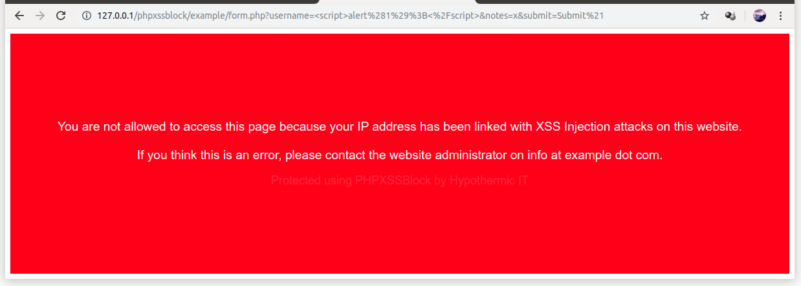

# PHP XSS Blocker

Block the IP Addresses of clients who are trying to exploit your website by using XSS.



## Usage

### Automatic usage

```php
TODO create an automatic method in XBlock
```

### Manual usage

At the top of each page, put:

```php
<?php
use HypothermicIT\XSSBlock\XBlock;

if (XBlock::isBlocked($_SERVER['REMOTE_ADDR'])) {
    include 'my-error-page.html';
    exit();
}
?>
```

And, when handling user input, validate each `$_GET` and `$_POST` through the XBlock Wrapper Methods:

```php
TODO
```

## Database

This library requires a database to store the list of blocked IP's.
It is very simple to set up the database, and an implementation for MySQL/MariaDB is included by default.
You will only need to create the database user and you're set.

```mysql
CREATE USER IF NOT EXISTS `xssblock-user`@`localhost` IDENTIFIED BY "change_me!";
CREATE DATABASE IF NOT EXISTS `XSSBlock`; USE `XSSBlock`;
CREATE TABLE IF NOT EXISTS `XSSBlock`.`Registry`
        (`ip_addr` varchar(48) NOT NULL PRIMARY KEY)
        ENGINE=InnoDB DEFAULT CHARSET=utf8;
GRANT SELECT, INSERT ON `XSSBlock`.`Registry` TO `xssblock-user`@`localhost`;
```

By default, the MySQL implementation will try to connect to `localhost:3306` with user `xssblock-user`.
You may change the settings in [`config.php`](config.php)

## Weaknesses

Of course, this project is more to scare off attackers than to provide security.
The red screen surely looks scary and discouraging.

Keep in mind that a smart attacker could "change" his IP address by using a proxy/vpn or by connecting to the Tor network.